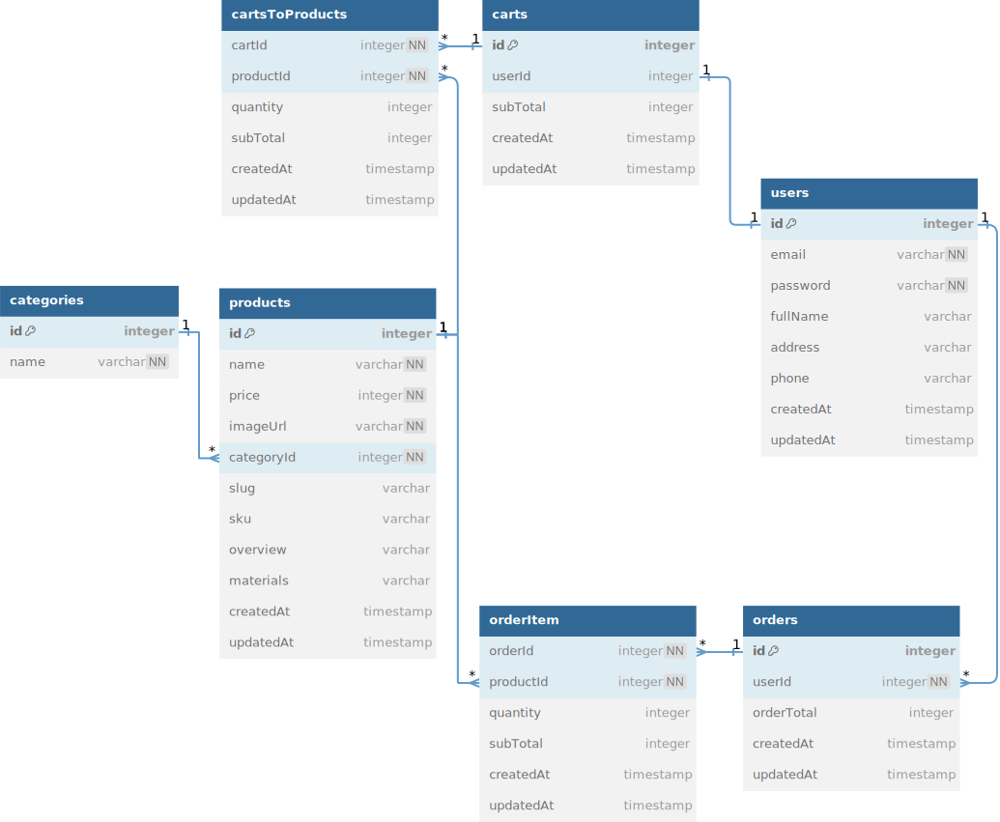

# Bambino API

API for Bambino, a simple and user-friendly e-commerce platform built to sell baby clothes.

## API Specification

### Register

### Login

Request :

- Method : POST
- Endpoint : `/login`
- Header :
  - Content-Type: application/json
  - Accept: application/json
- Body :

```json
{
  "email": "string",
  "password": "string"
}
```

Response :

```json
{
  "code": "number",
  "status": "string",
  "data": {
    "token": "string"
  }
}
```

### Authentication

All API below must use this authentication

Request :

- Header :
  - Authorization: "Bearer {token}"

### Create Product

Request :

- Method : POST
- Endpoint : `/products`
- Header :
  - Content-Type: application/json
  - Accept: application/json
- Body :

```json
{
  "name": "string",
  "price": "integer",
  "imageUrl": "string",
  "categoryId": "string",
  "slug": "string",
  "sku": "string",
  "overview": "string",
  "materials": "string"
}
```

Response :

```json
{
  "code": "number",
  "status": "string",
  "data": {
    "id": "string",
    "name": "string",
    "price": "integer",
    "imageUrl": "string",
    "categoryId": "string",
    "slug": "string",
    "sku": "string",
    "overview": "string",
    "materials": "string"
  }
}
```

### Get Products

Request :

- Method : GET
- Endpoint : `/products?page=1&limit=10&q={name}`
- Header :
  - Content-Type: application/json
  - Accept: application/json

Response :

```json
{
  "code": "number",
  "status": "string",
  "data": {
    "totalData": "integer",
    "totalPage": "integer",
    "products": [
      {
        "id": "string",
        "name": "string",
        "price": "integer",
        "imageUrl": "string",
        "categoryId": "string",
        "slug": "string",
        "sku": "string",
        "overview": "string",
        "materials": "string"
      }
    ]
  }
}
```

### GET Product by id

Request :

- Method : GET
- Endpoint : `/products/{id}`
- Header :
  - Content-Type: application/json
  - Accept: application/json

Response :

```json
{
  "code": "number",
  "status": "string",
  "data": {
    "id": "string",
    "name": "string",
    "price": "integer",
    "imageUrl": "string",
    "categoryId": "string",
    "slug": "string",
    "sku": "string",
    "overview": "string",
    "materials": "string"
  }
}
```

### Update Product

Request :

- Method : PUT
- Endpoint : `/products/{id}`
- Header :

  - Content-Type: application/json
  - Accept: application/json

- Body :

```json
{
  "name": "string",
  "price": "integer",
  "imageUrl": "string",
  "categoryId": "string",
  "slug": "string",
  "sku": "string",
  "overview": "string",
  "materials": "string"
}
```

Response :

```json
{
  "code": "number",
  "status": "string",
  "data": {
    "id": "string",
    "name": "string",
    "price": "integer",
    "imageUrl": "string",
    "categoryId": "string",
    "slug": "string",
    "sku": "string",
    "overview": "string",
    "materials": "string"
  }
}
```

### Delete Product

Request :

- Method : DELETE
- Endpoint : `/products/{id}`
- Header :
  - Accept: application/json

Response :

```json
{
  "code": "number",
  "status": "string"
}
```

## Database Design



## Links

- Production: <https://bambino-api.budigunawan.com>
- Swagger: <https://bambino-api.budigunawan.com/swagger>

## Tech Stacks

- [Bun](https://bun.sh/)
- [Hono](https://hono.dev/)
- [Typescript](https://www.typescriptlang.org/)
- [PostreSQL](https://www.postgresql.org/)
- [Prisma](https://www.prisma.io/)
- [Zod](https://hono.dev/examples/zod-openapi)
- [SwaggerUI](https://hono.dev/examples/swagger-ui)

## Getting Started

To install dependencies:

```sh
bun install
```

To run:

```sh
bun run dev
```

open http://localhost:3000
